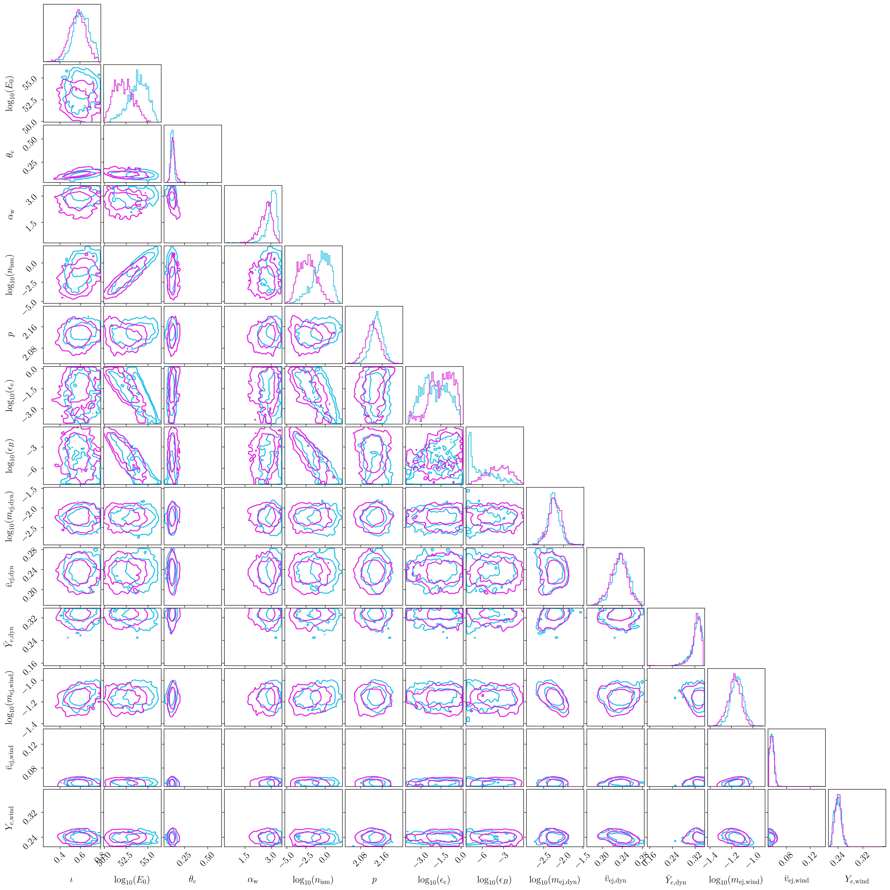
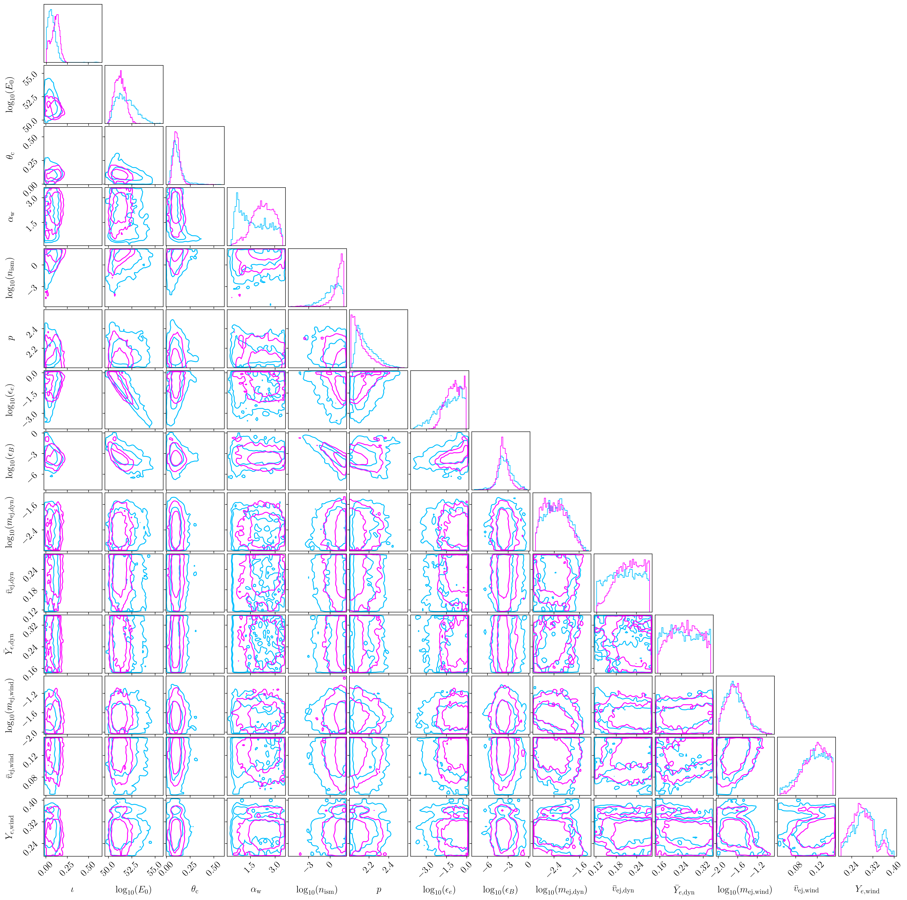

# Efficient Bayesian analysis of kilonovae and GRB afterglows with fiesta

This repo contains data products and scripts for their analysis used in "Efficient Bayesian analysis of kilonovae and GRB afterglows with fiesta" by Hauke Koehn, Thibeau Wouters and others.

The repo structure roughly follows the outline of the paper. ``benchmarking`` contains benchmarking plots for our surrogates, ``injections`` will show the injections that we ran, and ``real_events`` contains our posteriors for GRB170817A and GRB211211A. It also contains the scripts to generate the full corner plot from Fig. 8 and Fig. 10.
We also show them below.

To run some of the scripts, fiesta methods are required. Therefore, it is advised to install it from the main repo. Also, the scripts sometimes point to the files containing the training data. These are quite large and can be made available upon private request.

### AT2017gfo/GRB170817A

### GRB211211A 

